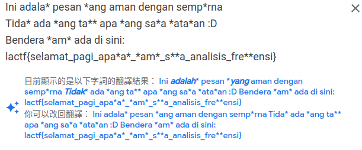

# selamat pagi
> If you talk in another language, nobody can understand what you say! Check out this message I sent in Indonesian. To add some extra security, I also applied a monoalphabetic substitution cipher on it!

## Problem
- Reverse the monoalphabetic substitution
- The original message is in Indonesian

## Solve
I assume the original text consist of the following words:
- *lactf* (flag format, 100% sure)
- *selamat pagi* (the challenge title)
- *bendera* (trasnlation of "flag" in Indonesian)

By comparing with the cipher text, we can find the following substitution:
- lactf -> bkvim
- selamat pagi -> wzbkdki ckse
- bendera -> Lzfqztk

So I write the following program
```python
import string

knowns = {
    # cipher: original
    "bkvim": "lactf",
    "Lzfqztk": "bendera",
    "wzbkdki": "selamat",
    "ckse": "pagi",
}

def monoalphabetic_substitution(ciphertext, substitution_key):
    plaintext = []
    for char in ciphertext:
        if not char.isalpha():
            plaintext.append(char)
            continue

        if char not in substitution_key:
            plaintext.append('*')
            continue

        plaintext.append(substitution_key[char])
    return ''.join(plaintext)

substitution_key = {}
for key,value in knowns.items():
    key = key.lower()
    value = value.lower()
    assert len(key) == len(value)
    for i in range(len(key)):
        a,b = key[i], value[i]
        # check if it already exist
        if a in substitution_key:
            assert substitution_key[a] == b
            continue
        substitution_key.update({a:b, a.upper():b.upper()})

missing_key = set([ c for c in string.ascii_lowercase if c not in substitution_key.keys()])
missing_value = set([ c for c in string.ascii_lowercase if c not in substitution_key.values()])
assert len(missing_key) == len(missing_value)

with open('message.txt', 'r') as file:
    ciphertext = file.read()
decrypted_text = monoalphabetic_substitution(ciphertext, substitution_key)

print("---")
print(ciphertext)
print("---")
print(decrypted_text)
print("---")
```

Although there are some missing character, we can find them with the help of google translate.


The problem can be solve by putting those character back to the `known` list, and repeat a few times.

Final `known` list:
```python
knowns = {
    # cipher: original
    "bkvim": "lactf",
    "Lzfqztk": "bendera",
    "wzbkdki": "selamat",
    "ckse": "pagi",
    "x": "h",
    "a": "y",
    "u": "k",
    "j": "u",
}
``` 