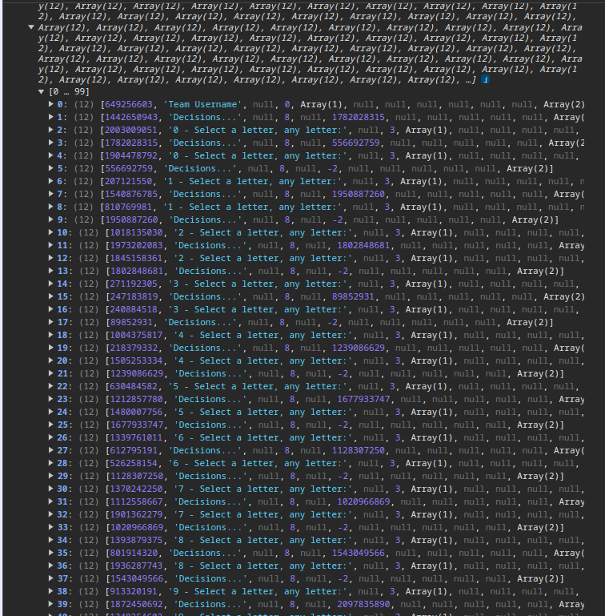
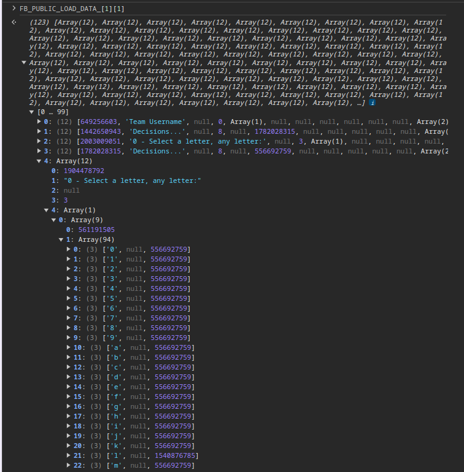

# one by one
> One..... by.......... one............... whew I'm tired, this form is waaaaaaay too long.
> 
>Note: the flag does have random characters at the end - that is intentional.

## Problem
- Google form

## Solve
Similar to [infinite loop](../infinite_loop/).

The challenge is related to `FB_PUBLIC_LOAD_DATA_`, but hidden inside for this time.

if we start analysis the data, we can find that `FB_PUBLIC_LOAD_DATA_[1][1]` store all the information about the form

| brief                  | detail                 |
| ---------------------- | ---------------------- |
|  |  |

In the detail picture, we can see all the optional that can be select in the form.

And there is something special about letter `l`, it is the only one with different value.

If we repeat the progress for entry 8,12,16,20,24, we can get the string `lactf{` which is the prefix of flag.

To make it easier, I save that data to [data.json](./data.json) and wrote a [python script](./solve.py) to solve the question.
